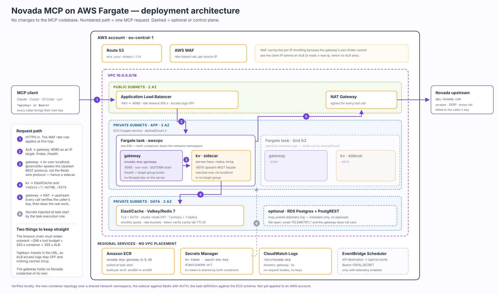

# AWS architecture — Novada MCP gateway on Fargate



*(Also rendered as [`architecture.png`](./architecture.png) for tools that do not
display SVG. Source of truth is the `.svg`.)*

This document explains **why** the architecture looks like this. The click-by-click
build order is in [`README.md`](./README.md); the task definition is
[`taskdef.json`](./taskdef.json).

The governing constraint: **no changes to the MCP codebase.** Everything the
application expects but AWS does not natively provide is absorbed by the task
topology instead of by a patch.

---

## One request, end to end

**1 · Client → ALB.** An MCP client speaks Streamable HTTP to `POST /mcp` and
authenticates with its own Novada API key, either `?apikey=…` or
`Authorization: Bearer …`. Route 53 resolves the name; the WAF rate-based rule is
evaluated at this hop, per source IP.

**2 · ALB → gateway.** The target group holds IP targets on port 8080 and probes
`/health`, which answers 200 without auth and without touching Redis — so a task
that has lost its data path still reports healthy until a real request fails. That
is deliberate: it distinguishes "the process is up" from "the dependencies are
up", and the second signal belongs in CloudWatch, not in the LB probe.

**3 · gateway → kv sidecar.** The gateway reads and writes quota counters, rate
buckets and the token-verify cache through `@vercel/kv`, which is `@upstash/redis`
underneath — an HTTP/REST protocol. ElastiCache cannot answer that, so a
`serverless-redis-http` container in the same task translates. Both containers sit
in one `awsvpc` network namespace, so this hop is `http://127.0.0.1:8079` — no
service discovery, no network hop, no security group.

**4 · kv → ElastiCache.** The sidecar holds a pooled connection to ElastiCache
over `rediss://` with an AUTH token. Everything stored here is TTL'd: monthly
quota per key hash, per-minute rate buckets, a 90-second negative/positive cache
for key verification, and OAuth authorization codes. Losing the cluster costs
counters, not customer data.

**5 · gateway → upstream.** Every single call verifies the caller's key against
`POST /v1/wallet/balance` at `api.novada.com` (cached 90 s) and then performs the
actual tool work against Novada's scraper, SERP and proxy endpoints. This traffic
leaves through the NAT gateway. **Without egress nothing works** — not even a
`tools/list`, because listing is gated behind key validation.

**6 · Secrets.** Three Secrets Manager entries are injected as environment
variables by the *task execution* role at task start. They never appear in the
task definition, in ECR, or in the image.

---

## Component roles

| Component | Why it is here | If it is missing |
|---|---|---|
| ALB | TLS termination, health checking, one stable DNS name; the only public entry | no ingress |
| AWS WAF | per-IP throttling that the application cannot do behind an ALB (see below) | one client can burn the whole quota pool |
| ECS Fargate service | runs the gateway; stateless, so any task can serve any request | – |
| gateway container | the actual MCP server: transport, auth, quota, dispatch, OAuth, telemetry | – |
| kv sidecar | Upstash-REST → Redis translation | `/mcp` answers `500 KV_NOT_CONFIGURED` |
| ElastiCache | quota, rate buckets, token cache, OAuth codes — all TTL'd | as above; the gateway fails closed, it does not silently skip quota |
| NAT gateway | outbound to `api.novada.com` | every request 401s or times out |
| Secrets Manager | `kv-token` (shared by both containers), `oauth-enc-key`, `elasticache-url` | task starts but `/mcp` fails; OAuth grant endpoints fail closed |
| CloudWatch Logs | the only observability surface; metadata only | blind operations |
| ECR | image storage, pulled at task start | – |
| RDS + PostgREST *(optional)* | the `mcp_events` telemetry log in the Supabase REST shape | telemetry no-ops, fail-open |
| EventBridge Scheduler *(optional)* | drains the telemetry push backlog via `POST /api/reconcile` | backlog grows, nothing else breaks |

---

## The four decisions worth knowing

### The sidecar is not a convenience

`api/mcp.ts` imports `kv` from `@vercel/kv`. That package speaks the Upstash REST
API, not the Redis wire protocol, so ElastiCache is not a drop-in no matter how it
is configured. Without a code change there are exactly two options: Upstash (REST
native, not an AWS service) or a translating sidecar. This design picks the
sidecar so the datastore can be a managed AWS service.

The honest cost: `serverless-redis-http` is a small single-maintainer OSS project
sitting in the path of every quota check. The alternative is a ~60-line KV adapter
behind a `REDIS_URL` env var talking to ElastiCache directly — a PR against
`hosted-server/vercel/api/`, which is out of scope here.

### Rate limiting moved to the WAF, and it had to

`getClientIp()` (`api/mcp.ts:1745`) reads `x-vercel-forwarded-for` and
`x-real-ip`. It never reads `x-forwarded-for`. Both limiters return early when the
resolved IP is `"unknown"` (`:772`, `:789`). An ALB sets `X-Forwarded-For`,
`X-Forwarded-Proto`, `X-Forwarded-Port` and `X-Amzn-Trace-Id` — never
`X-Real-Ip`. So behind a bare ALB the application-level limiters are silently
inactive.

Adding a Traefik hop looks like the fix and is measurably worse. Traefik does set
`X-Real-Ip`, but to the address that connected to *it* — even with
`forwardedHeaders.trustedIPs=0.0.0.0/0`. Measured locally: a request carrying
`X-Forwarded-For: 203.0.113.7` produced the Redis bucket `pra:172.23.0.1:…`, the
proxy's own peer. Behind an ALB that is one shared bucket for every customer: at
`RATE_LIMIT_PER_MIN=60` the service throttles itself.

A WAF rate-based rule does the job natively, per source IP, with no code and no
extra hop. The per-key monthly quota is unaffected either way — it is keyed by
token hash, not by IP.

### The timeout chain must widen outward

```
tool budget (TOOL_WALL_CLOCK_MS, api/mcp.ts)   ~296 s
container request timeout (MCP_REQUEST_TIMEOUT_MS)  320 s
ALB idle timeout                                    350 s
```

Any inversion turns a slow-but-successful tool call into a bare 504 from the load
balancer. A 504 is not valid JSON-RPC, so the MCP client does not see a tool error
— it sees a broken transport. The gateway is built to always answer first: it
raises a structured `TASK_PENDING` error at its own ceiling rather than letting
the socket die.

### The gateway holds no Novada credential

At module load, `api/mcp.ts` deletes every server-side consumption credential from
`process.env` (`NOVADA_API_KEY`, developer key, unblocker key, browser WS, all
proxy variables). Each caller pays on their own account, and a bug in credential
resolution cannot silently bill a server-owned key. Consequence for AWS: there is
no Novada secret to store, rotate or leak — only the three infrastructure secrets.

---

## Security posture

**Network.** Only the ALB is public. Tasks run in private subnets with
`assignPublicIp=DISABLED`; egress via NAT. The kv sidecar has no port mapping and
no security group path — it is reachable only from inside its own task's network
namespace. ElastiCache accepts traffic only from the task security group, with TLS
and an AUTH token.

**Secrets.** Injected by the task execution role, which needs
`secretsmanager:GetSecretValue` on exactly three ARNs. `kv-token` must be the same
value in both containers (`SRH_TOKEN` and `KV_REST_API_TOKEN`) — it is the shared
secret of the localhost hop. `elasticache-url` contains the AUTH token, which is
why it is a secret and not an environment variable.

**The unavoidable exposure: `?apikey=` in the URL.** MCP clients that cannot send
custom headers put the key in the query string, and the path-auth variant
`/<key>/mcp` puts it in the path. Therefore: ALB access logs **off**, no CloudFront
or proxy cache in front of `/mcp`, and no request-URI logging anywhere. Prefer
`Authorization: Bearer` wherever the client supports it. The gateway itself never
logs the key — it stores only a SHA-256 hash as the KV quota key.

**Logs.** CloudWatch receives operational lines and the telemetry event log
carries metadata only: tool name, argument *key names*, target *hostname*, outcome,
latency. No payloads, no queries, no full URLs, and identity fields are
AES-256-GCM encrypted when `NOVADA_LOG_IDENTITY_AES_KEY` is set.

---

## Failure modes

| Symptom | Cause | Where to look |
|---|---|---|
| `500 KV_NOT_CONFIGURED` | `KV_REST_API_URL/TOKEN` not visible to the gateway | gateway log line at boot: `kv=MISSING` |
| `503 STUB_AUTH_UNACKED` | `STUB_AUTH_WARNING_ACCEPTED` is not `"true"` | task definition environment |
| `401 INVALID_TOKEN` on a key that works elsewhere | no egress to `api.novada.com`, or the key really is wrong | NAT/route table, then the `/ecs/novada-mcp` gateway stream |
| Task flaps between healthy and draining | ALB health check interval shorter than container start, or `startPeriod` too low | target group + `healthCheck.startPeriod` |
| Long tool calls return 504 with no JSON-RPC body | ALB idle timeout below the container timeout | the timeout chain above |
| All clients get 429 at low traffic | an `X-Real-Ip`-setting proxy in front, collapsing everyone into one bucket | remove the hop; use the WAF rule |
| `telemetry insert failed 401` | PostgREST JWT/role mismatch, or missing `SELECT` grant needed by `resolution=ignore-duplicates` | `../telemetry/05-mcp-events-baseline.sql` |

---

## Scaling and cost shape

Tasks are stateless with no session affinity, so scaling is pure horizontal:
target tracking on `ALBRequestCountPerTarget` (or CPU). `desiredCount 2` across
two AZs is the sensible floor. Scale-in is safe — SIGTERM triggers a connection
drain, `stopTimeout: 40` gives it room, and the process exits 0.

Vertical sizing is driven by tool work, not by transport: HTML parsing (`cheerio`),
PDF extraction (`pdf-parse`) and Excel generation (`exceljs`) are the memory
consumers. 1 vCPU / 2 GB per task is a reasonable start; watch
`MemoryUtilization` before trimming.

Cost drivers, in rough order: Fargate task-hours (`desiredCount` × size), NAT
gateway data processing (every tool call's payload crosses it), the ALB, then
ElastiCache. Graviton (`ARM64`) tasks are cheaper per vCPU-hour and the image
builds for it natively. For actual numbers use the
[AWS Pricing Calculator](https://calculator.aws/) — it accounts for the region and
your data volumes, which is where all of the variance lives.

---

## Verified vs. assumed

Verified locally against the exact images in `taskdef.json`:

- the two-container topology over a **shared network namespace** (what `awsvpc`
  gives a task): gateway → `127.0.0.1:8079` → sidecar → Redis **with AUTH**;
  `/health` 200, `/mcp` reached the gateway, and the token-verify key landed in
  Redis
- the sidecar answers `PING` over the Upstash REST body protocol that
  `@vercel/kv` uses, and `nc -z 127.0.0.1 8079` works as its ECS health check
- `taskdef.json` passes the AWS CLI's client-side schema validation for
  `RegisterTaskDefinition`
- the `linux/amd64` image builds and boots (`process.arch = x64`)
- Traefik's `X-Real-Ip` behaviour described above (that is why it is not in the
  diagram)

Assumed, not verified — needs an account with valid credentials:

- every `aws` command in the runbook (the local session token is expired)
- the sidecar against a real TLS ElastiCache endpoint; TLS support is
  source-verified in SRH (`rediss://` → `ssl: true` + hostname verification via
  `castore`), not runtime-verified
- ALB behaviour on a genuinely >300 s tool call
- WAF rule tuning: `Limit: 600` per 5-minute window is a starting point, not a
  measured value
